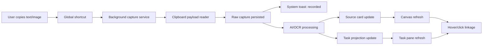
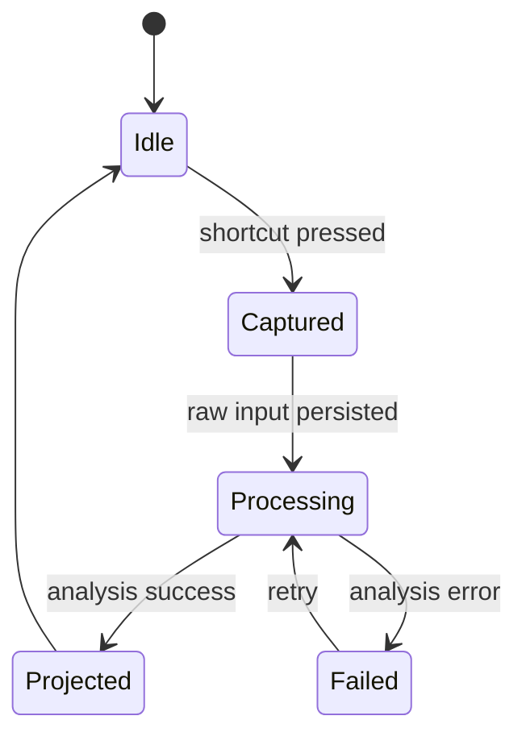

# 捕获链设计与第二阶段开发计划 v0.1

更新时间：2026-03-12

## 1. 文档目标

这份文档回答两个问题：

1. 你的产品里“捕获链”具体指什么。
2. 下一阶段应该优先把哪一段链路做实。

这份文档默认承接当前已落地的第一版桌面骨架：

- Electron 后台常驻
- 托盘与全局快捷键
- 左画布右待办双栏
- 本地仓储与 AI adapter 抽象

## 2. 定义

在这个产品里，`捕获链` 指的是：

`用户复制内容并按下快捷键之后，系统如何在不打断用户的前提下，把原始信息收进系统、整理成来源卡片、再投影出待办项的整条流水线。`

它不是单点功能，而是一条端到端链路。

## 3. 完整链路拆解

## 4. 为什么它是核心

你的产品价值不在于“用户会不会打开一个无限画布编辑”。

而在于：

- 用户不需要手动录入
- 用户不需要先决定怎么分类
- 用户只要判断“这条信息要不要收”

所以真正决定产品体验的，不是画布引擎本身，而是这条链路是否：

- 足够快
- 足够稳
- 足够轻
- 足够不打断

## 5. 当前版本已经有的链路部分

当前代码里已经成立的部分：

- 剪贴板文本/图片读取
- 全局快捷键触发
- 本地持久化
- 系统通知
- 左侧来源卡片生成
- 右侧待办列表生成
- 来源与待办映射

但当前仍偏向 `同步式演示链路`，还不是更真实的 `后台产品链路`。

## 6. 当前最需要补强的链路段

### 6.1 阶段化状态

当前问题：

- 捕获、分析、投影几乎是同步完成的
- 用户看不到“已收录但仍在整理”的状态

应补强为：

- `captured`
- `processing`
- `projected`
- `failed`

这样既符合真实 AI/OCR 处理流程，也更利于后续接云端异步任务。

### 6.2 原始内容优先落地

原则：

- 先保存原始内容
- 再做分析
- 分析失败也不能丢内容

这决定了产品是否真的让人敢放心依赖。

### 6.3 图片链路

图片捕获不能只做到“存起来”，还要考虑：

- 本地附件落盘
- Inspector 预览
- OCR 预留接口
- 后续转文字摘要

### 6.4 失败反馈与重试

第一版 AI/OCR 很可能不稳定。

所以系统必须具备：

- 失败状态
- 明确提示
- 保留原始来源卡片
- 后续重试入口

### 6.5 链路可见性

用户虽然不想被打断，但系统必须让用户知道：

- 已经记住了
- 正在整理
- 整理完成了

这类反馈应该是轻量、可扫一眼的，而不是弹出大窗口。

## 7. 第二阶段建议目标

第二阶段不是继续堆页面，而是把捕获链从“能演示”升级成“更像真实产品”。

建议目标：

1. 支持异步捕获状态流转
2. 在 UI 中展示最近捕获状态
3. 支持图片附件预览
4. 为 OCR 与未来远端 AI 任务预留更清晰的边界

## 8. 第二阶段开发清单

### P0

- 捕获先落本地，再进入分析态
- 分析完成后再生成待办投影
- 分析失败不丢原始来源
- UI 显示最近捕获流水状态
- Inspector 支持附件预览

### P1

- OCR adapter 抽象
- 本地 mock OCR
- 失败重试按钮
- 去重或相似检测入口

### P2

- 远端任务队列预留
- 云同步前的 operation log 预留
- 更细的捕获来源类型识别

## 9. 推荐状态机

## 10. 数据层建议

### Capture

建议新增或明确这些字段：

- `aiStatus`
- `errorMessage`
- `attachmentIds`
- `ocrText`
- `processedAt`

### UI State

建议新增：

- `captureFeed`
- `lastCaptureAt`
- `activeCaptureCount`

### Attachment

建议继续保持：

- 附件与元数据分离
- UI 通过接口取附件内容
- 不让渲染层直接耦合底层文件结构

## 11. 与未来后端的关系

第二阶段这些改动不是“为了本地版更复杂”，而是为了未来不上后端时也能保持架构正确。

因为未来如果接：

- OCR 服务
- 远端 AI 抽取
- 云同步
- 多端队列

本质上都需要“先收录、后异步整理”的链路。

## 12. 当前判断

结论：

- 现在最值得投入的不是继续加页面，而是把捕获链做成真正的产品主流程。
- 无限画布仍然重要，但它应当服务于收录链，而不是替代收录链。
- 第二阶段最对的方向是：`异步状态化 + 附件可见 + 失败不丢 + 后端预留更清晰。`
