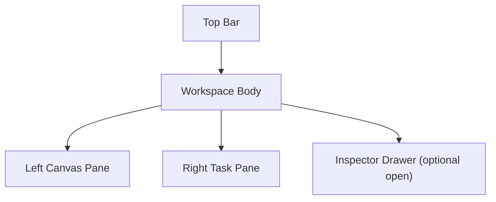
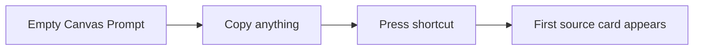
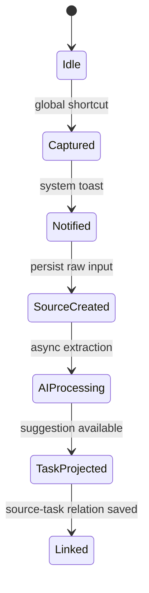
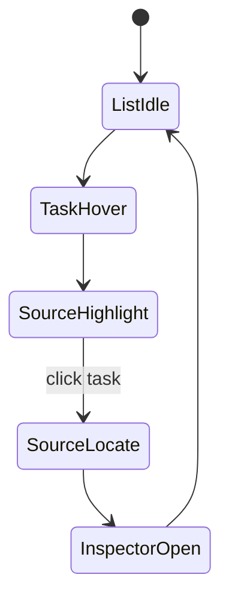
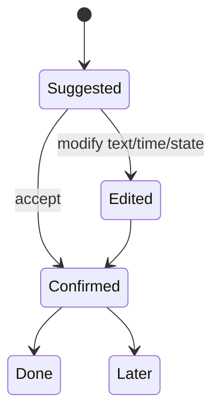

# 双栏工作区页面草图与状态流转 v0.1

更新时间：2026-03-12

说明：

- 这是一份低保真结构设计文档。
- 目标不是视觉定稿，而是把页面层级、主状态和关键交互讲清楚。
- 依据 `ui-ux-pro-max` 的优先规则，重点遵守可理解性、hover/click 反馈、可访问性和布局稳定性。

## 1. 设计目标

双栏工作区必须同时做到：

- 左边看起来像“来源工作台”
- 右边看起来像“行动摘要层”
- 两边关系一眼能懂
- 即使主窗口没打开，收录动作也成立

最关键的认知瞬间是：

`用户把鼠标移到右侧待办上时，立刻看到左侧来源被点亮，并理解“哦，这件事是从这里来的”。`

## 2. 页面骨架



### Top Bar

包含：

- 全局搜索
- 当前 Board 名称
- 捕获状态提示
- 筛选入口
- 设置入口

### Background Capture Layer

这是主窗口外的补充层，包含：

- 托盘常驻
- 全局快捷键监听
- 系统右下角轻量通知

它不属于主界面，但属于完整产品体验。

### Left Canvas Pane

包含：

- 来源卡片
- 图片来源
- 文本来源
- 轻量分区背景

### Right Task Pane

包含：

- 待办列表
- 状态切换
- 时间线索
- 来源数量提示

### Inspector Drawer

包含：

- 原文
- AI 摘要
- 时间建议
- 关联来源
- 关联待办

## 3. 推荐尺寸

桌面默认建议：

- 左侧画布：`72%`
- 右侧待办：`28%`
- Inspector 打开时从右侧待办之上再滑出，或覆盖右侧的一部分

原因：

- 画布必须是主舞台
- 右侧列表必须足够宽，能读完整待办摘要
- 右侧过窄会让“投影层”退化成图标栏

## 4. 低保真草图

```text
+----------------------------------------------------------------------------------+
| Search | Board: Inbox | Filter | Capture Ready | Settings                        |
+--------------------------------------+-------------------------------------------+
| Left Source Canvas                   | Right Task Projection                     |
|                                      |                                           |
|  [Chat screenshot]                   |  Today                                    |
|  "下周三之前给我初稿"                |  1. 给初稿 v1                             |
|                                      |     due: next Wed   sources: 2            |
|        [Poster image]                |                                           |
|                                      |  Pending                                  |
|  [Voice memo text]                   |  2. 确认活动海报修改                      |
|                                      |     sources: 1                            |
|            [Note cluster]            |                                           |
|                                      |  Later                                    |
|                                      |  3. 看一下报价截图                        |
|                                      |                                           |
+--------------------------------------+-------------------------------------------+
| Inspector Drawer (optional): raw content / AI summary / links / edit state      |
+----------------------------------------------------------------------------------+
```

## 5. 来源卡片设计

来源卡片建议由 3 层组成：

1. 头部
   - 简短标题
   - 来源类型图标

2. 主体
   - 原文缩略或图片缩略

3. 底部
   - AI 标签
   - 关联待办数量

交互要求：

- 卡片 hover 时边框明显
- 被右侧待办联动高亮时，使用更强的描边和柔和背光
- 不建议长期显示全部连线，避免画布过脏

## 6. 待办项设计

单条待办建议包含：

- 标题
- 时间线索
- 来源数量
- 状态标记

交互要求：

- 整条待办都是可 hover / 可点击区域
- 最小点击区域不小于 44px 高
- hover 有背景和左侧高亮反馈
- 选中后有更稳定的状态，不只是一闪而过

## 7. 关键页面状态

### 状态 A：空画布初始态

目标：

- 用户第一次打开不会面对“完全空白的大白板”

建议：

- 左侧显示弱结构占位区
- 右侧显示“复制内容并按快捷键开始”



### 状态 B：捕获成功态

目标：

- 用户立刻知道“已经收进来了”

建议：

- 如果主窗口打开：
  - 顶部出现短暂成功提示
- 左侧新来源卡片短暂发光
- 右侧如果已经生成待办，则轻微插入动画

如果主窗口未打开：

- 电脑右下角出现轻量通知
- 文案建议类似：
  - `已记录到画布`
  - `正在整理为待办`

### 状态 C：AI 处理中

目标：

- 让用户知道系统还在理解内容，但不打断

建议：

- 左侧卡片角标显示 `AI analyzing`
- 右侧先不生成待办，或生成 skeleton

### 状态 D：hover 待办态

目标：

- 让“来源回指”成为产品记忆点

建议：

- 右侧当前待办背景高亮
- 左侧相关来源描边增强
- 两栏之间出现一条轻量连线

### 状态 E：点击待办定位态

目标：

- 把“知道来源”升级成“回到来源”

建议：

- 左侧画布平滑平移到来源区域
- 来源卡片保持 1 到 1.5 秒选中高亮
- Inspector 可自动展示对应原文

### 状态 F：一对多来源态

目标：

- 避免用户搞不懂一条待办为什么关联多个来源

建议：

- 左侧多个来源同时高亮
- 右侧待办显示 `sources: 3`
- Inspector 中列出来源清单

## 8. 状态流转

### 8.1 捕获到投影



### 8.2 浏览到定位



### 8.3 编辑确认



## 9. 交互细则

### Hover 规则

- hover 只作为桌面增强体验
- 必须提供 click 作为等价操作
- 必须提供键盘聚焦后的高亮反馈

### 动效规则

- hover 反馈 150ms 到 220ms
- 连线用 opacity / transform 过渡
- 不做大范围晃动或弹跳

### 可访问性规则

- 右侧列表支持键盘上下移动
- 焦点到待办项时也应触发左侧高亮
- 颜色对比度满足可读要求

## 10. 第一版最值得坚持的设计点

1. 右侧待办一定要像“从左侧长出来的”，而不是普通侧栏。
2. 连线只在需要时出现，不能让画布长期杂乱。
3. 空状态必须友好，否则用户会把它误解成普通白板。
4. hover 体验必须有 click 和键盘 fallback，不能只服务鼠标用户。
5. 后台收录提示必须轻，不打断，但不能让用户怀疑“到底有没有记进去”。

## 11. 当前建议

如果只保留一个最核心的界面判断，我建议是：

`先把“hover 右侧待办 -> 左侧来源高亮并可定位”做到极其清楚，再去做更复杂的 AI 和更自由的画布。`

因为这一步一旦成立，整个产品的独特性就立住了。
