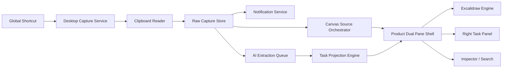

# Excalidraw 二开方案 v0.1

更新时间：2026-03-12

## 1. 文档目标

本文件回答三个问题：

1. 为什么第一版适合基于 Excalidraw 做。
2. 怎么避免把产品做成“Excalidraw 改个皮”。
3. 如何实现“左画布右待办投影”的核心交互。

## 2. 技术策略结论

结论：

- 第一版适合基于 `Excalidraw` 做 MVP。
- 但要把 `Excalidraw` 严格定位为 `左侧来源画布引擎`。
- 右侧待办投影、来源映射、hover 联动必须在产品业务层实现。

## 3. 为什么适合从 Excalidraw 起步

Excalidraw 已成熟解决：

- 可平移/可缩放画布
- 文本与图片粘贴
- 元素拖拽与选区
- 本地数据格式与导入导出
- 画布性能与交互细节

这使第一版不需要从零实现：

- 画布引擎
- 基础编辑交互
- 来源卡片的空间化摆放能力

## 4. 为什么不能只做 Excalidraw 换皮

如果保留 Excalidraw 的原始主心智，用户还是会以“画图工具”方式使用它：

- 先想用哪个工具
- 再想怎么摆元素
- 再自己手动写任务

而你的产品主流程应该是：

- 复制内容
- 按快捷键
- 后台服务接收收录
- 系统右下角提示“已记录 / 正在整理”
- 左侧画布自动收纳来源
- 右侧列表自动投影待办
- hover 或 click 在两边之间来回确认上下文

所以产品壳必须由以下模块主导：

- Capture HUD
- Dual Pane Workspace
- Task Projection Panel
- Inspector
- Search

## 5. 建议技术形态

第一版推荐：

- `Electron + React + Vite + Excalidraw`

原因：

- 全局快捷键更自然
- 剪贴板图片和文本读取更稳定
- 可以做常驻后台和托盘能力
- 更符合“像工具一样随手记”的桌面使用心智

## 6. 总体架构



## 7. 模块拆分

### 7.1 Desktop Capture Service

职责：

- 注册全局快捷键
- 读取当前剪贴板内容
- 识别文本 / 图片 / 混合输入
- 将原始数据交给业务层
- 在主窗口未打开时也能工作

### 7.2 Notification Service

职责：

- 在捕获后显示系统级轻量提示
- 告知用户“已记录”或“正在整理”
- 在失败时提供简短错误反馈

提示原则：

- 不打断
- 不弹主窗口
- 信息短、状态清楚

### 7.3 Raw Capture Store

职责：

- 持久化原始捕获数据
- 记录原文、图片、创建时间、AI 结果

建议字段：

- `id`
- `createdAt`
- `sourceType`
- `rawText`
- `imageAssetIds`
- `aiStatus`
- `aiSummary`
- `aiTaskSuggestions`
- `aiTimeSuggestion`
- `tags`

### 7.4 AI Extraction Queue

职责：

- 异步处理新捕获内容
- 输出摘要、待办建议、时间线索、轻标签
- 将结果写回 store

原则：

- AI 失败不能阻塞收录
- 原文必须保留
- AI 结果可忽略、可改写

### 7.5 Canvas Source Orchestrator

职责：

- 决定新来源卡片在左侧画布的落点
- 管理来源卡片的默认排布
- 将 Capture 映射为画布对象

### 7.6 Task Projection Engine

职责：

- 根据 Capture 与 AI 结果生成右侧待办条目
- 维护待办与来源卡片的一对一 / 一对多关系
- 管理右侧待办的状态与排序

核心要求：

- 右侧待办不是独立录入系统
- 一个待办可以关联多个来源
- 一个来源也可以支撑多个待办

### 7.7 Product Dual Pane Shell

职责：

- 承载左画布 + 右待办列表 + 顶部状态栏 + Inspector
- 屏蔽不必要的 Excalidraw 原始 UI
- 暴露产品级交互

### 7.8 Link Interaction Layer

职责：

- hover 右侧待办时高亮左侧来源
- 在两栏之间绘制瞬时连线
- 点击待办时定位左侧来源
- 点击来源时高亮右侧相关待办

这层是产品识别度最高的交互之一。

## 8. 数据模型建议

第一版不要自定义 Excalidraw 原生元素类型。

建议做法：

- 业务层保存 `Capture`、`SourceCard`、`TaskItem`、`Board`、`Attachment`
- 画布层使用 `rectangle + text + image + frame + customData`
- 用外部映射保存待办与来源关系
- 所有对象都使用稳定 ID，并按未来同步场景设计

### 8.1 业务对象

#### Capture

原始输入记录。

#### SourceCard

左侧主画布中的来源卡片。

建议字段：

- `id`
- `captureId`
- `boardId`
- `title`
- `summary`
- `tags`
- `position`
- `visualGroupId`

#### TaskItem

右侧待办列表中的行动对象。

建议字段：

- `id`
- `title`
- `summary`
- `status`
- `timeHint`
- `priority`
- `sourceCardIds`
- `confidence`

#### Board

工作空间。

#### Attachment

附件对象，承载截图、图片和未来可能的文件引用。

### 8.2 画布对象映射

建议：

- 一个 SourceCard 对应一个视觉卡片组
- 图片作为 image element
- 标题与摘要作为 text element
- 用 frame 或区域表达不同主题收纳片区

### 8.3 现在就必须做到的后端预留

即使第一版不上后端，也必须从现在开始遵守这些约束：

1. 存储抽象
   业务层不能直接依赖某个具体本地存储实现。

2. Schema version
   所有持久化对象必须带版本号，支持未来迁移。

3. Sync-ready IDs
   `Capture`、`SourceCard`、`TaskItem`、`Board`、`Attachment` 必须有稳定唯一 ID。

4. Attachment separation
   图片和大对象资源不能直接与元数据混存成一个大 blob。

5. AI adapter abstraction
   AI 调用不能直接写死到某个供应商 SDK。

6. Change-oriented updates
   重要写操作要尽量按“创建 / 更新 / 关联 / 状态流转”组织，而不是只靠整块覆盖。

## 9. UI 与交互策略

### 要保留的 Excalidraw 能力

- 缩放 / 平移
- 文本与图片元素
- 自由拖拽与空间排布

### 要弱化的 Excalidraw 能力

- 以绘图工具为中心的主流程
- 协作与分享优先心智
- 复杂工具层级

### 要新增的产品能力

- 全局捕获 HUD
- 左右双栏工作区
- 来源到待办的投影逻辑
- hover / select 双向联动
- 搜索与 Inspector
- 存储与 AI 抽象层

## 10. 第一版开发优先级

### P0：闭环成立

- Electron 壳
- 托盘常驻
- 全局快捷键
- 剪贴板文字/图片收录
- 系统通知
- 本地持久化
- Repository 抽象层
- Schema version 基础设施
- 左侧主画布
- 右侧待办列表
- 来源卡片自动生成与落位
- 基于 AI / 规则的待办投影
- hover 联动高亮
- 基础 Inspector

### P1：产品价值显形

- AI 摘要与时间线索提取
- 一对多来源关联
- 点击待办自动定位来源
- 搜索
- 待办状态流转：待确认 / 待办 / 稍后 / 完成

### P2：增强留存

- 去重与聚类
- 多板管理
- 浏览器扩展
- 云同步

## 11. 代码组织建议

```text
src/
  app/
  desktop/
  capture/
  domain/
  ai/
  boards/
  canvas/
  projection/
  repositories/
  storage/
  search/
  shared/
```

说明：

- `canvas/` 只放 Excalidraw 相关封装
- `projection/` 放待办投影与联动逻辑
- `domain/` 放 Capture、SourceCard、TaskItem
- `domain/` 放 Capture、SourceCard、TaskItem、Attachment
- `desktop/` 放 Electron 主进程与快捷键
- `repositories/` 放业务读写接口，不直接耦合本地或云端
- `storage/` 放本地实现和未来云端适配实现

## 12. 技术风险

1. 如果左右两栏只是拼接，没有真实映射，会失去产品核心。
2. 如果过早改 Excalidraw 内核，复杂度会迅速升高。
3. 如果后台常驻和通知体验不稳定，产品会失去“无感收录”的特性。
4. 如果没有独立业务层，后续很难支持来源到待办的投影关系。
5. 如果现在把数据写死在本地实现里，后续接云同步会非常痛苦。

## 13. 当前建议

- `保留 Excalidraw 作为左侧来源画布引擎`
- `把右侧待办投影与来源映射做成独立业务层`
- `第一版绝不碰 Excalidraw 原生元素扩展`

这样可以用最小技术成本验证真正的产品假设。
