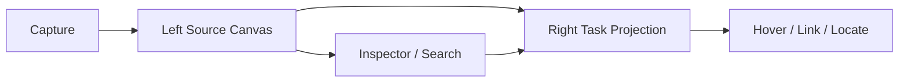

# 无限画布必要性决策备忘录 v0.1

更新时间：2026-03-12

## 1. 决策问题

问题：

`在“左侧主画布 + 右侧待办投影列表”的模型里，无限画布是不是必要组件？如果去掉无限画布，产品是否还成立？`

## 2. 结论

更精确的结论是：

- `画布` 在当前方案里基本是必要的。
- `无限` 是推荐方向，但不是第一版必须拉满的条件。

也就是说：

- 没有左侧画布，产品会明显变形。
- 没有“绝对无限”，产品仍然成立。

## 3. 为什么“画布”变成了必要组件

在你现在的方案里，左侧画布不是附属容器，而是：

- 来源真相层
- 上下文承载层
- 右侧待办的映射对象

右侧待办之所以有价值，不是因为它本身是一个列表，而是因为它永远能回指左侧来源。

如果拿掉左侧画布，右侧待办就会退化成：

- AI 自动生成任务
- 带一点附件的列表

这会离你的原始需求越来越远。

## 4. 为什么“无限”不是第一天必须

“无限”解决的是：

- 长期信息堆积后的空间余量
- 更自由的聚类和非线性排布
- 更大的视觉工作面

但第一版真正要验证的不是“空间有多大”，而是：

- 来源是否先进入画布
- 待办是否真能从来源投影出来
- hover / click 联动是否成立

所以第一版哪怕先做成“大尺寸、可平移、可扩展的画布工作区”，产品真相也仍然成立。

## 5. 如果去掉“无限”，产品会怎样

产品仍然可能保留：

- 左画布右列表
- 来源承载
- 待办投影
- 双向联动

变化主要在于：

- 空间余量更小
- 长期使用时更容易需要分页或分板
- “无限收纳”的品牌感会弱一些

## 6. 如果去掉“画布”，产品会怎样

会更像：

- AI Inbox
- 智能待办列表
- 轻量第二大脑

优点：

- 更容易理解
- 实现更容易

代价：

- 差异化大幅下降
- 会更直接进入 Todoist / Fabric / mymind 竞争区
- “hover 任务即可看到来源上下文”这个核心体验会消失

## 7. 推荐决策

推荐方案：

`保留左侧画布作为主工作面与来源层，右侧待办作为行动投影层；第一版优先验证两栏联动，不强求先把“无限”做到极致。`

结构如下：

## 8. 对 MVP 的影响

如果采用上面的决策，MVP 必须包含：

- 左侧来源画布
- 右侧待办投影列表
- hover / click 联动
- Inspector / Search

如果只做左侧画布，不做右侧投影：

- 产品更像收纳白板，不像待办产品

如果只做右侧列表，不做左侧画布：

- 可以验证捕获需求
- 但验证不了你最核心的差异化

## 9. 最终判断

一句话结论：

`在你当前的方案里，左侧画布是必要的；“无限”是重要方向，但不是第一版必须做到绝对无边界。`

因此第一版建议是：

- 保留左侧画布
- 保留右侧待办投影
- 把两栏联动当成最核心体验
- 把“无限”视为后续可增强的空间能力
