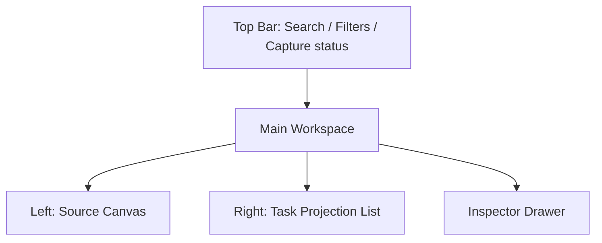
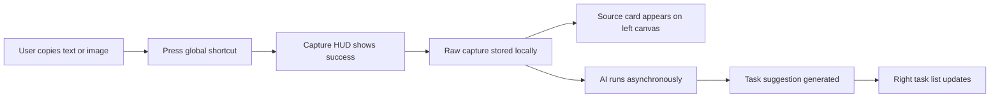
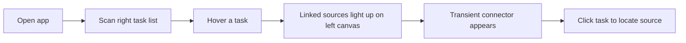
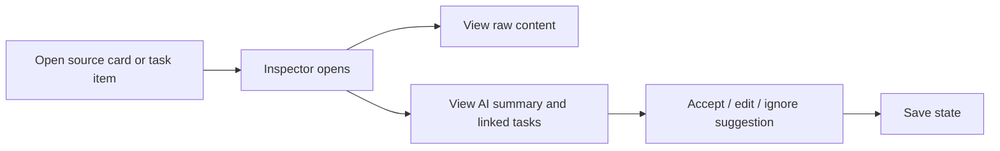
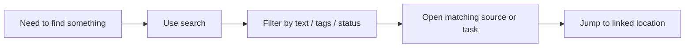

# 信息架构与主流程 v0.1

更新时间：2026-03-12

## 1. 信息架构目标

第一版信息架构要同时满足三件事：

1. 收录动作足够短。
2. 左侧画布与右侧待办列表的关系足够直观。
3. 用户既能行动，也不会丢掉上下文。

## 2. 核心对象

### Capture

原始输入对象，可能是：

- 一段文字
- 一张图片
- 文本 + 图片

### Source Card

Capture 在左侧画布中的可视化承载对象。

### Task Item

从一个或多个来源卡片中投影出来的右侧待办对象。

### Board

用户工作的主要空间。

## 3. 顶层模块

第一版建议只保留 5 个顶层模块：

| 模块 | 作用 |
| --- | --- |
| Capture HUD | 触发后即时确认收录 |
| Dual Pane Workspace | 左画布右待办列表的默认工作空间 |
| Inspector | 查看原文和 AI 建议 |
| Search | 搜索与筛选 |
| Settings | 快捷键、AI、存储设置 |

## 4. 默认布局

解释：

- `Left: Source Canvas`
  - 产品主体
  - 承载原文、截图、收纳内容和空间关系
- `Right: Task Projection List`
  - 展示从左侧来源中提取出的待办
  - 负责快速浏览与执行
- `Inspector Drawer`
  - 展示原文、AI 提示和关联关系

## 5. 导航原则

- 用户打开应用后默认进入双栏工作区。
- 不先进入项目树。
- 顶部只保留 Search、Filters、New Board、Settings。
- 右侧列表必须始终可见，不能藏太深。

## 6. 卡片与待办

一张来源卡片建议包含：

- 标题
- 原文缩略
- 图片缩略图
- AI 标签

一条待办建议包含：

- 标题
- 关联来源数量
- 时间线索
- 状态
- 轻量优先级

建议待办状态：

- `待确认`
- `待办`
- `稍后`
- `完成`

## 7. 主流程

### 7.1 捕获流程

关键体验要求：

- 成功反馈立即出现
- AI 不阻塞收录
- 用户第一次不需要额外编辑

### 7.2 联动浏览流程

关键体验要求：

- hover 必须轻量
- 连线应该是瞬时提示，不应长期污染画布
- 一对多来源时高亮规则必须清楚

### 7.3 语义确认流程

### 7.4 找回流程

## 8. 第一版界面清单

### 必做

- 双栏主工作区
- Inspector 抽屉
- Search 面板
- Settings 页

### 可延后

- 多 Board 管理页
- 时间轴页
- 统计页

## 9. 第一版交互建议

推荐主交互：

- 复制后快捷键收录
- hover 右侧待办高亮左侧来源
- 点击待办定位左侧来源
- 拖动来源卡片改变位置
- 单击切换待办状态
- 在 Inspector 里做轻编辑

避免第一版过早加入：

- 复杂右键菜单
- 过多模板
- 过多颜色语义
- 过深的工作区层级

## 10. 设计判断

第一版最重要的不是“做一个漂亮的大白板”，而是：

- 左右两栏的语义是不是一眼就懂
- 右侧待办是不是确实来自左侧来源
- 用户 hover 一个待办时，是否立刻知道“这件事是哪来的”

如果这些成立，空间化体验才会成为优势，而不是负担。
